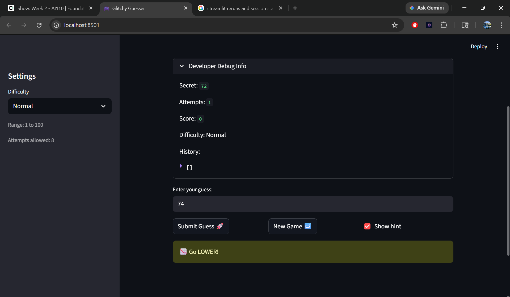
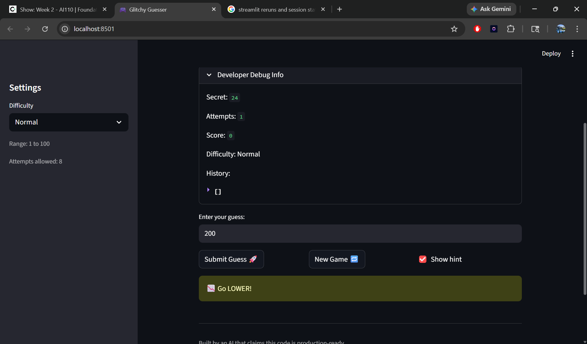

# 🎮 Game Glitch Investigator: The Impossible Guesser

## 🚨 The Situation

You asked an AI to build a simple "Number Guessing Game" using Streamlit.
It wrote the code, ran away, and now the game is unplayable. 

- You can't win.
- The hints lie to you.
- The secret number seems to have commitment issues.

## 🛠️ Setup

1. Install dependencies: `pip install -r requirements.txt`
2. Run the broken app: `python -m streamlit run app.py`

## 🕵️‍♂️ Your Mission

1. **Play the game.** Open the "Developer Debug Info" tab in the app to see the secret number. Try to win.
2. **Find the State Bug.** Why does the secret number change every time you click "Submit"? Ask ChatGPT: *"How do I keep a variable from resetting in Streamlit when I click a button?"*
3. **Fix the Logic.** The hints ("Higher/Lower") are wrong. Fix them.
4. **Refactor & Test.** - Move the logic into `logic_utils.py`.
   - Run `pytest` in your terminal.
   - Keep fixing until all tests pass!

## 📝 Document Your Experience

- [ ] Describe the game's purpose.
=> The game's purpose is simple. It is a normal number guessing game with three modes. It gives you attempts based on the hardness level. It provides you with a higher or lower based hint after every guess.
- [ ] Detail which bugs you found.
=> I found three bugs.
1. Type mismatch bug
2. Range validation
3. New Game State Reset Issues

- [ ] Explain what fixes you applied.
1. Type mismatch bug: Removed the code that was converting secret to a string on even attempts. This was breaking the comparison logic and causing mismatched hints.
2. Range validation: The info banner now uses the dynamic low/high values instead of hard coding 1–100.
The guessing game should no longer let out of range numbers slip through unnoticed.
3. New Game State Reset Issues: The status of New Game is reset to "playing".

## 📸 Demo
- [ ] [Insert a screenshot of your fixed, winning game here]

## 🚀 Stretch Features

- [ ] [If you choose to complete Challenge 4, insert a screenshot of your Enhanced Game UI here]
